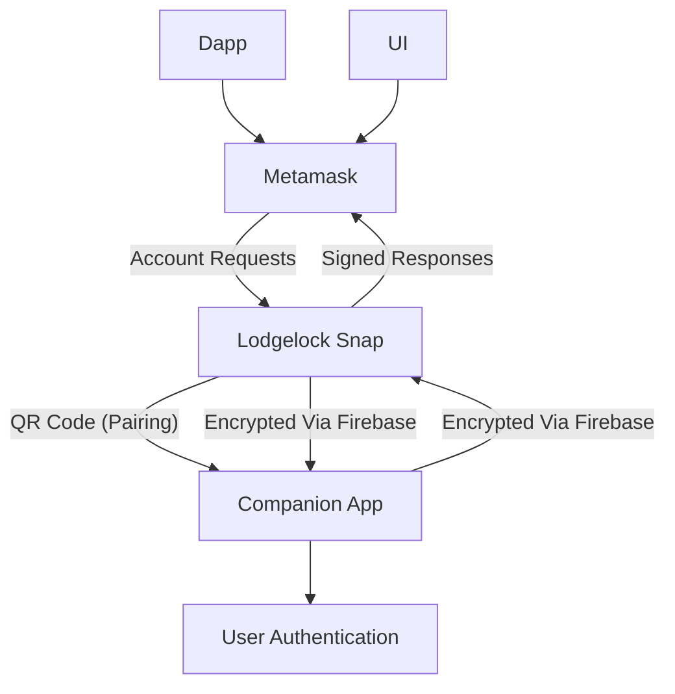

# Lodgelock

⚠️ Lodgelock is in active development and not yet suitable for holding significant funds.

Lodgelock is a hardware-wallet-like companion app for MetaMask that keeps private keys off your desktop, improving security while retaining convenience. It’s designed for developers and security-conscious users who want most of the safety of a hardware wallet without the cost or hassle of one.

Lodgelock leverages mobile device security to protect private keys, with all signing requiring on-device biometric approval. Keys never leave your device, mitigating the most common vectors for private key theft.

## Features

- Mobile-based private key storage
- Biometric approval for all signing requests
- Integration with MetaMask Snap
- Cloud signaling via Firebase for communication between Snap and mobile
- API-ready architecture for future general wallet integration

### Comparison

I've tested several existing MPC/account-management snaps. Each has strengths, but Lodgelock emphasizes portability, consistent per-sign authentication, and a clearer UX.

| Wallet Type            | Time to Sign | Resistance to Key Theft                 | Backup & Recovery            | Dependency on External Services | Cost / Accessibility       | Best fit scenarios                                                                                                   |
| ---------------------- | ------------ | --------------------------------------- | ---------------------------- | ------------------------------- | -------------------------- | -------------------------------------------------------------------------------------------------------------------- |
| **Lodgelock**          | \~1 min      | High (keys stay on mobile)              | Seed phrase backup in app    | Firebase / custom servers       | Free (smartphone only)     | Developers and security-conscious users who want hardware-like safety but faster, cheaper, and without extra devices |
| **Browser Extensions** | !30 seconds  | Low (keys hot in browser memory)        | Seed phrase backup           | None                            | Free                       | Casual users with very small balances who prioritize speed/convenience over security                                 |
| **WalletConnect**      | \~1 min      | High (keys stay on mobile)              | Seed phrase backup in app    | WalletConnect relay servers     | Free                       | Mobile-first users who interact with dapps occasionally and don’t want a browser extension                           |
| **MPC Wallets**        | \~1 min      | Medium–High (depends on implementation) | Proprietary recovery schemes | Typically 3rd-party infra       | Free / enterprise SaaS     | Teams, institutions, or users who want social recovery or shared custody at the cost of portability                  |
| **Hardware Wallets**   | 2–5 min      | Very High (keys in secure element)      | Seed phrase backup (offline) | None                            | Paid device (\~\$70–\$200) | Long-term holders with larger balances, low-frequency signing, or those needing maximum isolation                    |

| Snap             | Backup & Recovery                                 | Auth for Signing                              | Dependencies                       |
| ---------------- | ------------------------------------------------- | --------------------------------------------- | ---------------------------------- |
| **Lodgelock**    | Standard seed phrase (portable)                   | Biometric required each sign                  | Firebase (replaceable)             |
| **Para**         | Proprietary backup kit (PDF, non-portable)        | Session-based (no per-sign check)             | Central infra                      |
| **Silent Shard** | Proprietary recovery (Google account integration) | Optional biometric (on load only)             | Central infra                      |
| **Safeheron**    | 2-of-3 MPC with shard recovery option             | Two devices required per sign (browser + app) | LAN connection (no central server) |

## Architecture Overview

1. Lodgelock is split into two main components:
    - MetaMask Snap
    - Runs in the browser
    - Acts as the interface for account creation and transaction signing
    - Sends signing requests to the mobile device over Firebase
2. Mobile Companion App
    - Built with Expo
    - Stores private keys securely
    - Approves signing requests via biometric verification
    - Handles device pairing via QR code with shared secret

## Security

Lodgelock is still in development, so there may be bugs or other undesired behavior. Avoid storing large amount of money in Lodgelock accounts, and always make sure to backup your seed phrase.

Lodgelock is designed to:

- Ensures private keys never leave the mobile device (aside from manual seed phrase backups)
- Requires biometric approval for any operation that interacts with private keys
- Uses a shared secret between the snap and companion app to ensure encrypted communications.

### Account Backup & Recovery

Lodgelock generates and stores your seed phrase on the mobile device on setup. It can be backed up when first created, or anytime afterwards from the settings page. If you decide to switch to a different wallet after using lodgelock, you can [import your seed phrase](https://support.metamask.io/start/use-an-existing-wallet/#import-using-a-secret-recovery-phrase) into this new wallet to transfer over all accounts.

## Architecture Overview



## Development

### Requirements

- Node v20
- Yarn
- Expo Go for mobile testing

### Running

```bash
yarn dev:snap
yarn dev:mobile
```

### Test Application

Use the localhost site to install the snap & test signatures.

### License

GPL-3.0

- Note: Originally forked from the MetaMask Snap Template.
