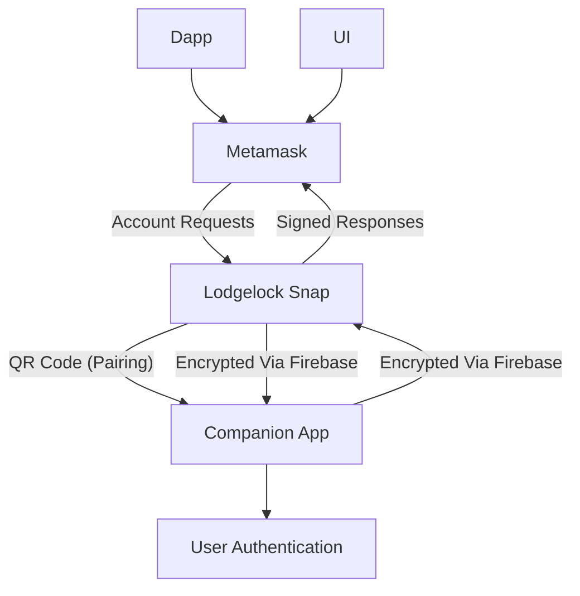

# Lodgelock

⚠️ Lodgelock is in active development and not yet suitable for holding significant funds.

Lodgelock is a hardware-wallet-like companion app for MetaMask that keeps private keys off your desktop, improving security while retaining convenience. It’s designed for developers and security-conscious users who want most of the safety of a hardware wallet without the cost or hassle of one.

Lodgelock leverages mobile device security to protect private keys, with all signing requiring on-device biometric approval. Keys never leave your device, mitigating the most common vectors for private key theft.

## Features

- Mobile-based private key storage
- Biometric approval for all signing requests
- Integration with MetaMask Snap
- Cloud signaling via Firebase for communication between Snap and mobile
- API-ready architecture for future general wallet integration

## Architecture Overview

1. Lodgelock is split into two main components:
    - MetaMask Snap
    - Runs in the browser
    - Acts as the interface for account creation and transaction signing
    - Sends signing requests to the mobile device over Firebase
2. Mobile Companion App
    - Built with Expo
    - Stores private keys securely
    - Approves signing requests via biometric verification
    - Handles device pairing via QR code with shared secret

## How it works



## Security notice

Lodgelock is security-focused. As such, it:
- Ensures private keys never leave the mobile device (aside from manual seed phrase backups)
- Requires biometric approval for any operation that interacts with private keys
- Uses a shared secret between the snap and companion app to ensure encrypted communications.

Lodgelock is still in development, so there may be bugs or other undesired behavior. Avoid storing large amount of money in Lodgelock accounts, and always make sure to backup your seed phrase.

## Development

### Requirements

- Node v20
- Yarn
- Expo Go for mobile testing

### Running

```bash
yarn dev:snap
yarn dev:mobile
```

### Test Application

Use the localhost site to install the snap & test signatures.

### License

GPL-3.0

- Note: Originally forked from the MetaMask Snap Template.
